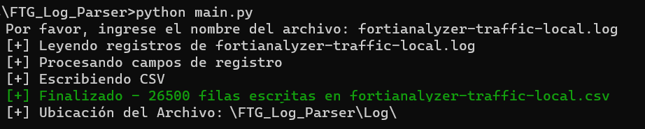
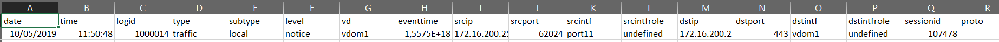

<div align="center">

[🇬🇧 English](ReadMe.md) · [🇪🇸 Español](ReadMe.es.md)

</div>

<div align="center">

# 🛡️ FTG Log Parser

**FortiGate firewall logs → clean CSV, in seconds.**


</div>

---

Network teams drowning in FortiGate logs need answers, not raw text. **FTG Log Parser** converts FortiGate log files into structured CSV so you can open them in Excel, load them into a SIEM, or feed them to pandas for analysis.

## ⚡ Quickstart

```bash
git clone https://github.com/fernedy/FTG_Log_Parser.git
cd FTG_Log_Parser
python main.py
```

1. Drop your log file into the `Log/` folder.
2. Run `python main.py` and type the file name.
3. Get your CSV. Done.

## 📸 Screenshots

| Application | Resulting CSV |
|---|---|
|  |  |

## 🗂️ Project structure

```text
├── main.py         # CLI entry point
├── Log2CSV.py      # Parser: FortiGate records → CSV
├── ColorText.py    # Colored console output
└── Log/            # Drop your .log files here
```

## 📚 References

- [Fortinet official sample logs](https://docs.fortinet.com/document/fortigate/6.2.15/cookbook/986892/sample-logs-by-log-type)

## 🤝 Contributing

PRs welcome — parsing rules for new FortiGate log types are the most useful contribution.

## 📜 License

MIT — see [LICENSE](LICENSE).

---

<div align="center">

Built by [Fernedy Arias](https://github.com/fernedy) · AI First · Tech Explorer

</div>
