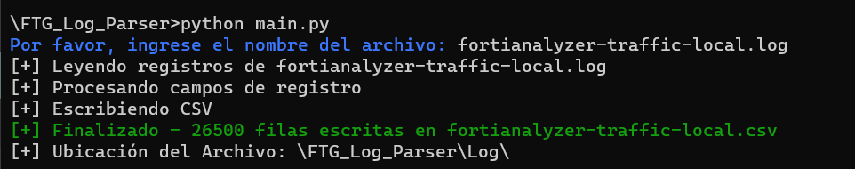

# Fortigate Log Parser

Fortigate Log Parser es una herramienta que te permite analizar registros de log generados por Fortigate y convertirlos en archivos CSV. Puedes utilizar esta herramienta para procesar registros y extraer información relevante de una manera eficiente.

## Instrucciones de Uso

### Requisitos Previos
- Python 3.x instalado en tu sistema.

### Pasos de Instalación
1. Clona el repositorio o descarga los archivos.
2. Asegúrate de tener Python 3.x instalado en tu sistema.
3. Ejecuta el archivo `main.py`.

### Ejemplo de Uso
1. Copia el archivo que deseas convertir en el folder con nombre Log
2. Ejecuta el archivo `main.py`.
3. Ingresa el nombre del archivo de log que deseas procesar.
4. La herramienta procesará los registros y generará un archivo CSV con los datos.

## Contribución
Si deseas contribuir a este proyecto, siéntete libre de hacerlo. Puedes sugerir mejoras, corregir errores o agregar nuevas características. Aquí hay algunas pautas:
- Sigue las convenciones de estilo de código.
- Crea una rama (branch) para tu contribución y realiza una solicitud de extracción (pull request).

## Licencia
Este proyecto se distribuye bajo la Licencia MIT. Consulta el archivo `LICENSE` para obtener más detalles.

## Autor
- Darlyn Fernedy González Arias

## Fuente
[Documentación Oficial Fortinet](https://docs.fortinet.com/document/fortigate/6.2.15/cookbook/986892/sample-logs-by-log-type)

## Capturas de Pantalla
- Vista de la Aplicación

- Archivo resultante

---

¡Espero que Fortigate Log Parser te sea útil! Si tienes alguna pregunta o encuentras algún problema, no dudes en comunicarte con nosotros.

